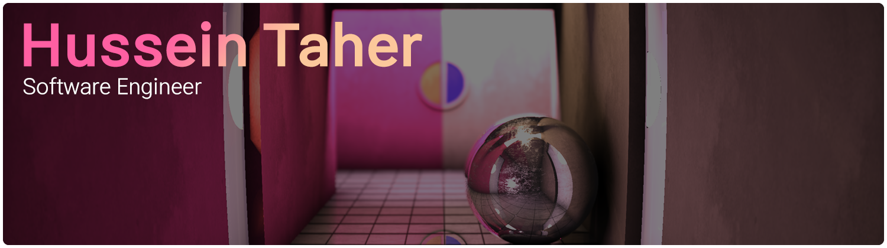

[][home]

# 👋Hi there!

I'm Hussein Taher, a Software Engineer from Sweden.
- 📚 Currently studying Computer Science and Engineering @ Lund University
- 🔭 Developing a collection of C++ libraries that can be used to build applications.
- ⌨ Solving Competitive Programming Problems on [kattis](https://open.kattis.com/users/dubulicious) and [CodinGame](https://www.codingame.com/profile/0e1c279e8dd942c30a8bfc4db6814ae74978921) in my spare time.
- 🎮 Playing videogames!
- 💬 Ask me about C++ or CMake 😁
- ⬜ Fun fact: I love tofu, so you will find the word _dubu_(두부) in a lot of my repositories because it's korean for tofu!

## 🌟Awesome Repos

[![][dubu-pack-card]][dubu-pack-link]
[![][dubu-serialize-card]][dubu-serialize-link]
[![][cmake-project-template-card]][cmake-project-template-link]
[![][hustle-card]][hustle-link]
[![][dubu-opengl-app-card]][dubu-opengl-app-link]
[![][dubu-rect-pack-card]][dubu-rect-pack-link]

## 📈Github Stats
[![][github-stats]][home]
[![][top-langs]][home]

## 🛠Languages and Tools
[][home]
[][home]
[][home]
[][home]
[][home]

[][home]
[][home]
[][home]
[][home]
[][home]
[][home]

[][home]
[][home]
[][home]
[][home]
[][home]
[][home]

[The banner is from a shader I made](https://www.shadertoy.com/view/wt23R3)

[dubu-pack-card]: https://github-readme-stats.vercel.app/api/pin/?username=husenap&repo=dubu-pack&hide_border=true&border_radius=5&bg_color=20,993961,97785d&title_color=ff9cc5&text_color=ffdfc4&icon_color=E6E6E6
[dubu-pack-link]: https://github.com/Husenap/dubu-pack
[dubu-serialize-card]: https://github-readme-stats.vercel.app/api/pin/?username=husenap&repo=dubu-serialize&hide_border=true&border_radius=5&bg_color=20,993961,97785d&title_color=ff9cc5&text_color=ffdfc4&icon_color=E6E6E6
[dubu-serialize-link]: https://github.com/Husenap/dubu-serialize
[cmake-project-template-card]: https://github-readme-stats.vercel.app/api/pin/?username=husenap&repo=cmake-project-template&hide_border=true&border_radius=5&bg_color=20,993961,97785d&title_color=ff9cc5&text_color=ffdfc4&icon_color=E6E6E6
[cmake-project-template-link]: https://github.com/Husenap/cmake-project-template
[hustle-card]: https://github-readme-stats.vercel.app/api/pin/?username=husenap&repo=hustle&hide_border=true&border_radius=5&bg_color=20,993961,97785d&title_color=ff9cc5&text_color=ffdfc4&icon_color=E6E6E6
[hustle-link]: https://github.com/Husenap/hustle
[dubu-opengl-app-card]: https://github-readme-stats.vercel.app/api/pin/?username=husenap&repo=dubu-opengl-app&hide_border=true&border_radius=5&bg_color=20,993961,97785d&title_color=ff9cc5&text_color=ffdfc4&icon_color=E6E6E6
[dubu-opengl-app-link]: https://github.com/Husenap/dubu-opengl-app
[dubu-rect-pack-card]: https://github-readme-stats.vercel.app/api/pin/?username=husenap&repo=dubu-rect-pack&hide_border=true&border_radius=5&bg_color=20,993961,97785d&title_color=ff9cc5&text_color=ffdfc4&icon_color=E6E6E6
[dubu-rect-pack-link]: https://github.com/Husenap/dubu-rect-pack

[github-stats]: https://github-readme-stats.vercel.app/api?username=husenap&show_icons=true&line_height=27&count_private=true&include_all_commits=true&hide_border=true&border_radius=5&bg_color=20,993961,97785d&title_color=ff9cc5&text_color=ffdfc4&icon_color=E6E6E6
[top-langs]: https://github-readme-stats.vercel.app/api/top-langs/?username=husenap&langs_count=3&hide=html,glsl,cmake,c&hide_border=true&border_radius=5&bg_color=20,993961,97785d&title_color=ff9cc5&text_color=ffdfc4&icon_color=E6E6E6

[home]: #
